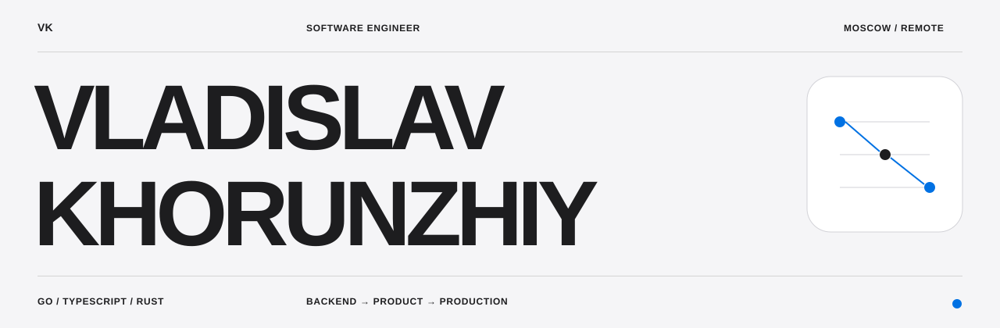

  

  
  
  

## About

I’m Vladislav — a backend engineer with **6 years of experience**, focused on Go,
distributed systems and production-oriented engineering.

I like building systems that stay understandable under load: clear boundaries,
explicit failure modes, useful observability and boringly reliable operations.

My main interests are:

- Go services, concurrency, gRPC and REST APIs;
- PostgreSQL, Kafka, caching and event-driven workflows;
- Docker, CI/CD, Linux and production diagnostics;
- protocol engineering and high-throughput infrastructure.

Rust and TypeScript are part of my wider toolkit — I use them when they make the
product or the system better, not as a substitute for a clear design.

## Selected work

| Project | What it is |
| --- | --- |
| [rust-interview-trainer](https://github.com/par1ram/rust-interview-trainer) | Full-stack trainer for Rust, backend and distributed-systems interviews, with isolated code execution and durable progress. |
| [stratum](https://github.com/par1ram/stratum) | Low-level Stratum V1/V2 protocol libraries: binary codecs, framing, channels, Noise and subprotocols. |
| [sv2-apps](https://github.com/par1ram/sv2-apps) | Stratum V2 pool, miner and integration-test applications built around the protocol libraries. |
| [ecom-microservices](https://github.com/par1ram/ecom-microservices) | Go e-commerce microservices with gRPC, isolated databases and a GraphQL gateway. |
| [auth-service](https://github.com/par1ram/auth-service) | Go authentication service with gRPC, JWT, SQLite and database migrations. |
| [aggregator](https://github.com/par1ram/aggregator) | Concurrent RSS aggregator in Go with PostgreSQL, a REST API and scheduled scraping. |
| [kafka](https://github.com/par1ram/kafka) | Go producer/consumer template for Apache Kafka with structured logging. |

Selected product and landing experiments

 

[vladislav-portfolio](https://github.com/par1ram/vladislav-portfolio) ·
[transmegalinkdon](https://github.com/par1ram/transmegalinkdon) ·
[forma-atrium-01](https://github.com/par1ram/forma-atrium-01) ·
[north-01-flagship-motion](https://github.com/par1ram/north-01-flagship-motion) ·
[aera-flagship-cms](https://github.com/par1ram/aera-flagship-cms) ·
[new visual prototypes](https://github.com/par1ram?tab=repositories)

## Engineering snapshot

  
  

  

## Currently

- building backend systems and developer tools;
- exploring reliable execution, observability and distributed workflows;
- keeping the public profile focused on engineering work, with product experiments
  as a supporting track.

## Contact

The fastest way to reach me is [Telegram](https://t.me/VladislavKhorunzhiy).

  Go first. Systems thinking always.

