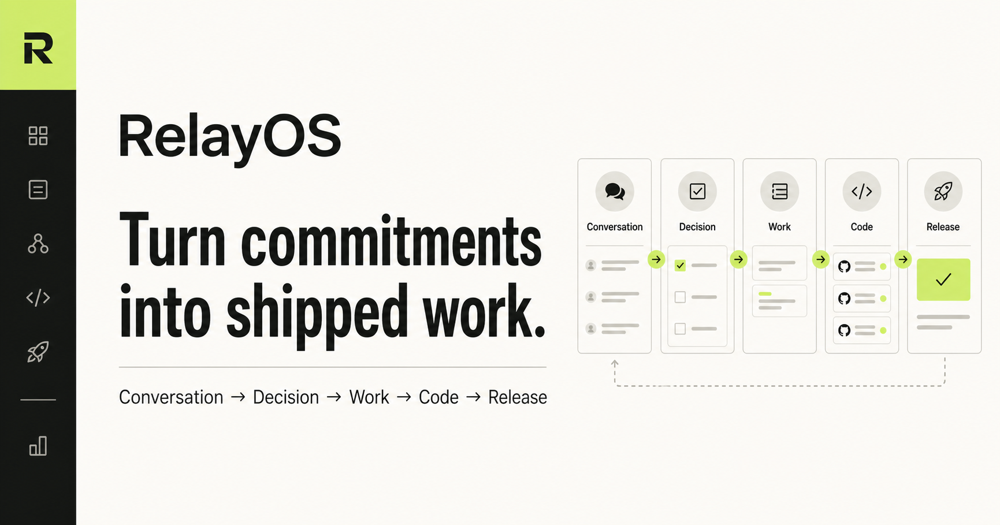
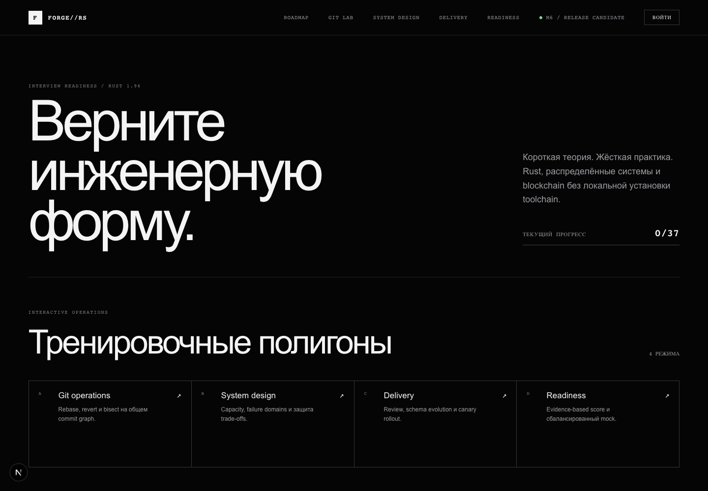

  

  <a href="https://transmegalinkdon.ru"><strong>Production work ↗</strong></a>
  &nbsp;·&nbsp;
  <a href="https://github.com/par1ram?tab=repositories">Repositories</a>
  &nbsp;·&nbsp;
  <a href="https://t.me/VladislavKhorunzhiy">Telegram</a>
  &nbsp;·&nbsp;
  Moscow / Remote

## Systems, interfaces, production.

Software engineer with 6+ years of production experience across mining
infrastructure, high-volume vehicle telemetry and fintech.

I work primarily with Go, PostgreSQL, Kafka and observability on the backend.
On product-facing work I use TypeScript, React and Next.js, including complex
motion and WebGL interfaces. The common thread is ownership of the complete
system: data model, failure paths, interface and release.

### Selected engineering evidence

| Area | Result |
| :-- | :-- |
| Mining infrastructure | Stratum Relay, virtual hashrate, external pool integrations and production incident analysis |
| Vehicle telemetry | Services for a fleet of 30,000+ cars; a Go/React emulator reduced scenario setup from 30 minutes to seconds |
| Fintech | Idempotent payment processing; PostgreSQL load reduced by 30% with Redis and asynchronous Kafka processing |
| Engineering education | 58 executable missions, 277 hidden tests and an isolated Rust runner |

### Selected product work

<table>
  <tr>
    <td width="50%" valign="top">
      
        
      <strong>TransMegaLinkDon ↗</strong> 
      Production website for an engineering company with an interactive 3D product scene.  
      <code>Next.js</code> <code>TypeScript</code> <code>R3F</code>
    </td>
    <td width="50%" valign="top">
      
        
      <strong>ATRIUM ↗</strong> 
      Architecture interface with a synchronized camera, lighting system and material configurator.  
      <code>Next.js</code> <code>Three.js</code> <code>WebGL</code>
    </td>
  </tr>
</table>

<table>
  <tr>
    <td width="50%" valign="top">
      
        
      <strong>RelayOS</strong> — in development 
      A B2B execution system connecting meeting evidence, approved work and code delivery.  
      <code>Next.js</code> <code>PostgreSQL</code> <code>Realtime</code>
    </td>
    <td width="50%" valign="top">
      
        
      <strong>Rust Interview Trainer</strong> — local-first release 
      Full-stack engineering course with executable missions, hidden tests and an isolated Rust runtime.  
      <code>Rust</code> <code>Next.js</code> <code>PostgreSQL</code>
    </td>
  </tr>
</table>

### Core stack

| Backend | Data | Product | Infrastructure |
| :-- | :-- | :-- | :-- |
| Go, Rust, REST, gRPC, GraphQL | PostgreSQL, Redis, Kafka, ClickHouse | TypeScript, React, Next.js, WebGL | Linux, Docker, Kubernetes, Nginx, GitLab CI |

### Public repositories

- [**FORMA / ATRIUM 01**](https://github.com/par1ram/forma-atrium-01) —
  production-oriented 3D architecture landing with a CRM adapter.
- [**E-commerce microservices**](https://github.com/par1ram/ecom-microservices) —
  Go services behind a GraphQL gateway, gRPC and isolated databases.
- [**AkiraBlade**](https://github.com/par1ram/akirablade) —
  full-stack storefront with PostgreSQL, Prisma and Docker.
- [**RSS Aggregator**](https://github.com/par1ram/aggregator) —
  concurrent Go scraper, REST API and PostgreSQL persistence.

 

  Software engineer · Moscow / Remote · 2026

