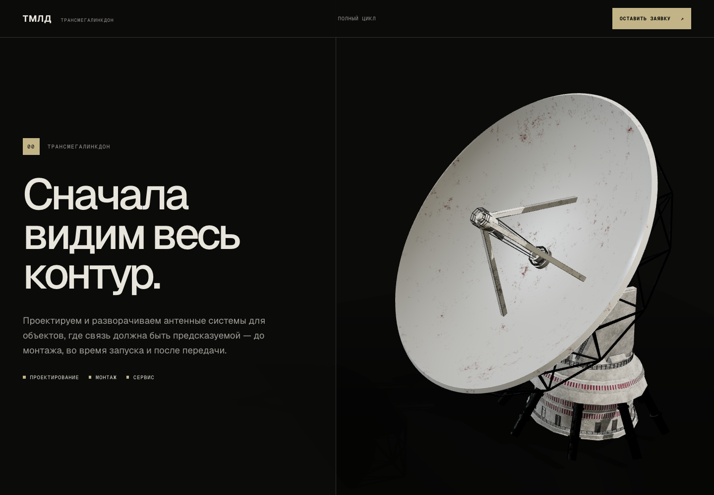
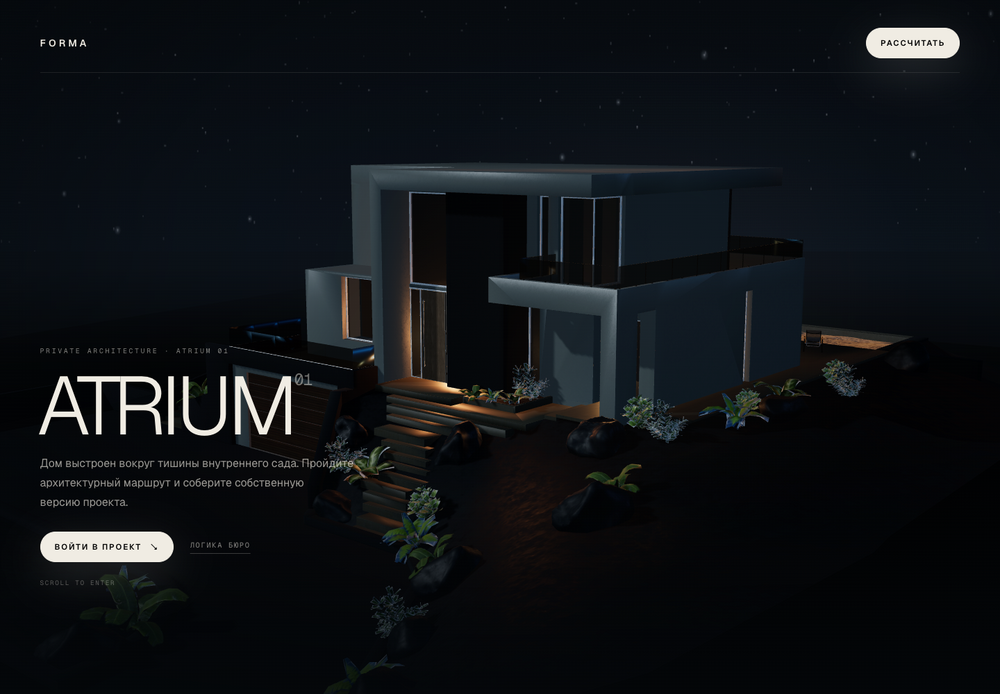
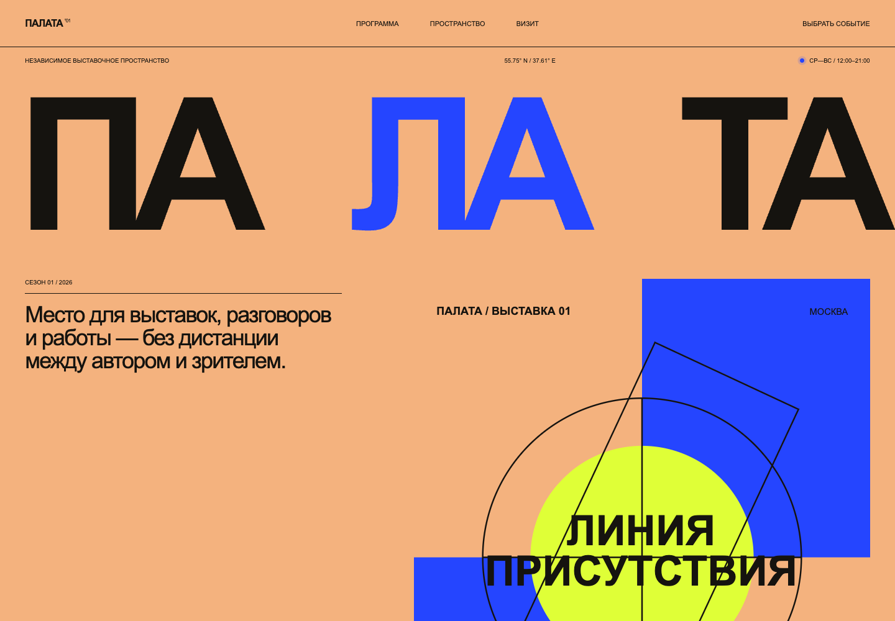
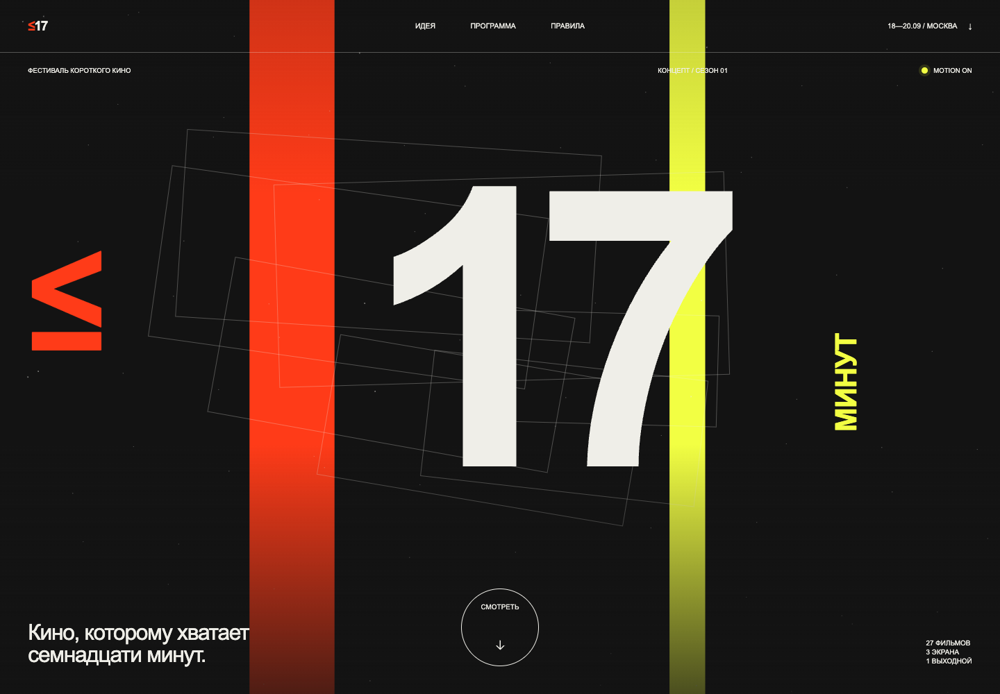

  

  <a href="https://transmegalinkdon.ru"><strong>Live work ↗</strong></a>
  &nbsp;·&nbsp;
  <a href="https://github.com/par1ram?tab=repositories">Repositories</a>
  &nbsp;·&nbsp;
  Moscow / Remote

## Design, code, launch.

Независимый дизайнер и разработчик. Проектирую и собираю сайты целиком:
от структуры и визуального языка до motion, production-кода, Git и запуска.

Сейчас мой фокус — выразительные лендинги, интерактивные 3D-интерфейсы и
небольшие full-stack продукты, которые не выглядят как шаблон.

### Selected work

<table>
  <tr>
    <td width="50%" valign="top">
      
        
      <strong>01 / ТрансМегаЛинкДон ↗</strong> 
      Корпоративный production-сайт: дизайн, frontend и живая 3D-сцена.  
      <code>Next.js</code> <code>TypeScript</code> <code>R3F</code>
    </td>
    <td width="50%" valign="top">
      
        
      <strong>02 / ATRIUM ↗</strong> 
      Архитектурный промо-сайт с управляемой камерой и конфигуратором.  
      <code>Next.js</code> <code>Three.js</code> <code>Motion</code>
    </td>
  </tr>
</table>

<table>
  <tr>
    <td width="50%" valign="top">
      
        
      <strong>03 / ПАЛАТА</strong> 
      Редакционный лендинг с inline-CMS, историей версий и VPS-ready storage.  
      <code>CMS</code> <code>Editorial</code> <code>Motion</code>
    </td>
    <td width="50%" valign="top">
      
        
      <strong>04 / ≤17</strong> 
      Кинетический фестивальный промо-сайт с Canvas и конструктором маршрута.  
      <code>Canvas</code> <code>Interaction</code> <code>Motion</code>
    </td>
  </tr>
</table>

### Public code

- [**FORMA / ATRIUM 01**](https://github.com/par1ram/forma-atrium-01) —
  production-minded 3D architecture landing with a CRM adapter.
- [**AkiraBlade**](https://github.com/par1ram/akirablade) —
  full-stack fashion storefront with PostgreSQL, Prisma and Docker.
- [**E-commerce microservices**](https://github.com/par1ram/ecom-microservices) —
  Go services behind a GraphQL gateway, gRPC and isolated databases.
- [**RSS Aggregator**](https://github.com/par1ram/aggregator) —
  concurrent Go scraper, REST API and PostgreSQL persistence.

### Working stack

`TypeScript` · `React` · `Next.js` · `Three.js / R3F` · `Node.js / NestJS` ·
`Go` · `PostgreSQL` · `Docker` · `Vercel` · `VPS`

 

  Independent designer &amp; developer · Moscow / Remote · © 2026

